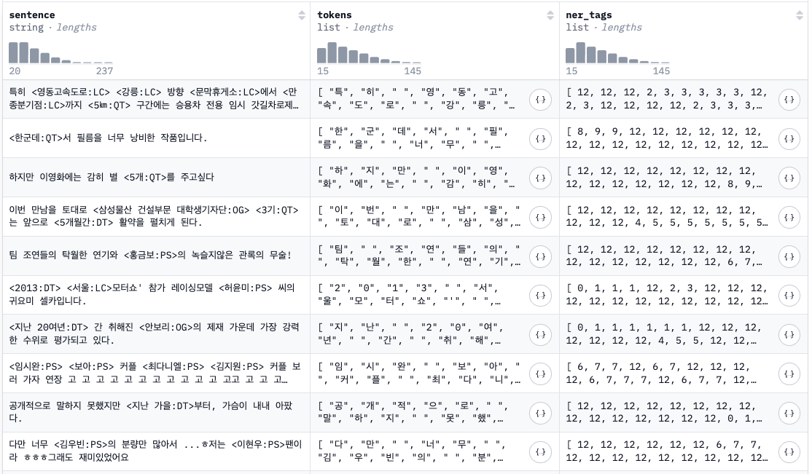
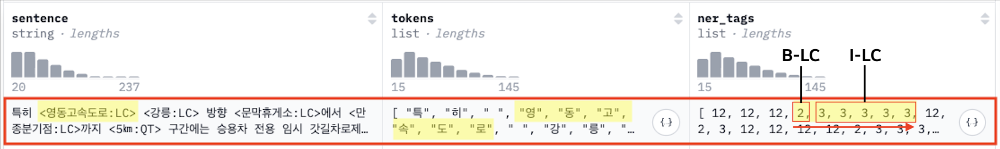
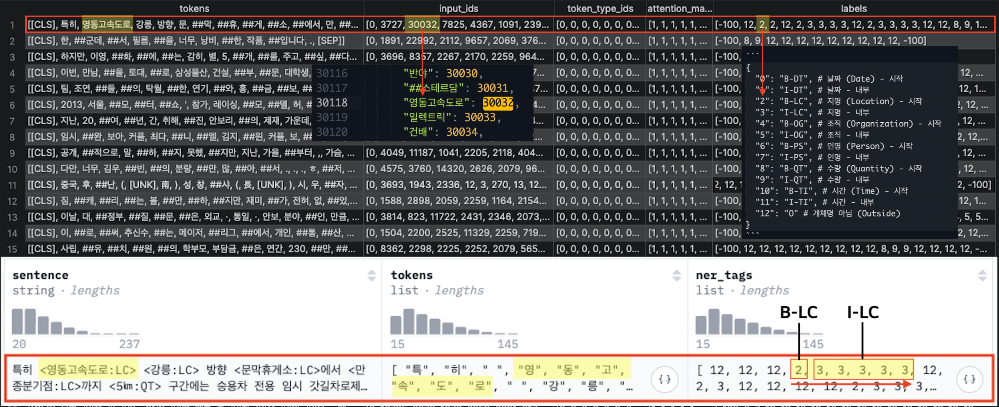
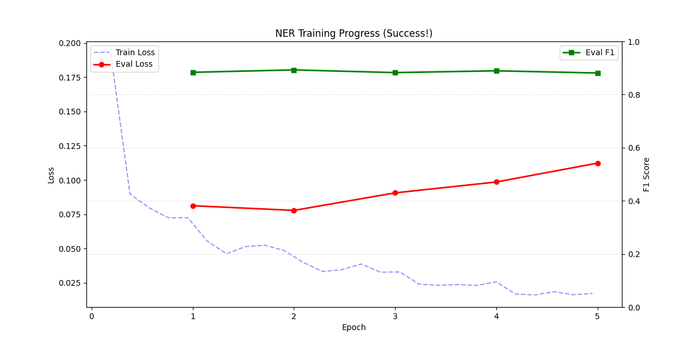
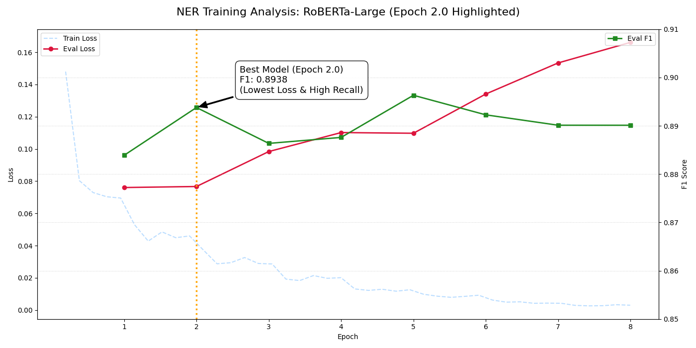

# 1. Data Preprocessing


* klue/klue의 Subset `ner` 활용
    - NER 데이터셋 특징
        1. 음절 단위 토큰화
            - tokens : `["특", "히", " ", "영", "동", "고", "속", "도", "로", ... ]`
        2. 태깅/라벨링 (BIO Format)
            ```
            {
              "0": "B-DT", # 날짜 (Date) - 시작
              "1": "I-DT", # 날짜 - 내부
              "2": "B-LC", # 지명 (Location) - 시작
              "3": "I-LC", # 지명 - 내부
              "4": "B-OG", # 조직 (Organization) - 시작
              "5": "I-OG", # 조직 - 내부
              "6": "B-PS", # 인명 (Person) - 시작
              "7": "I-PS", # 인명 - 내부
              "8": "B-QT", # 수량 (Quantity) - 시작
              "9": "I-QT", # 수량 - 내부
              "10": "B-TI", # 시간 (Time) - 시작
              "11": "I-TI", # 시간 - 내부
              "12": "O" # 개체명 아님 (Outside)
            }
            ```
            - https://en.wikipedia.org/wiki/Inside%E2%80%93outside%E2%80%93beginning_(tagging)
    - Example
        


* 문제점
    - 사용 베이스 모델 `klue/roberta-base` (한국어 특화 & 가벼운 모델)
        + 샘플 데이터 셋의 token과 tag가 음절 단위로 구성되어 있음.
        + 하지만 사용하려는 base 모델의 토큰나이즈 방식은 형태소/서브워드 방식(WordPiece)임.
            * tokens : `["특히", "영동", "##고속도로", ...]` (공백 토큰화 (X))
        + 우리가 학습/추론할 때, 베이스 모델은 음절단위로 토큰화하지 않기 때문에, 결국 해당 데이터과 동일한 룰셋으로 학습/추론 상황을 만들 수 없음.
        + 해당 샘플을 그대로 활용할 수는 없어, 해당 데이터셋을 기준으로 WordPiece 방식 재토큰화 및 재태깅을 진행함.
          

<br>

# 2. Model Training
베이스 모델 `klue/roberta-base`에는 인코더만 있음. 이에 따라, NER 용 헤드 추가학습 필요

## 2.1. Hyperparameter
```python
config = AutoConfig.from_pretrained(
        BASE_MODEL_DIR,
        num_labels=len(label_list),
        id2label=id2label,
        label2id=label2id,
        # Dropout
        hidden_dropout_prob=0.1,
        attention_probs_dropout_prob=0.1,
    )

...

training_args = TrainingArguments(
        output_dir=OUTPUT_MODEL_DIR,
        overwrite_output_dir=True,
        eval_strategy="epoch",
        save_strategy="epoch",
        save_total_limit=2,
        learning_rate=2e-5,
        # Regularization - Micro batch
        per_device_train_batch_size=8,
        per_device_eval_batch_size=8,
        # Regularization - L2
        weight_decay=0.01,
        load_best_model_at_end=True,
        metric_for_best_model="f1",
        num_train_epochs=10,
    )
...
```

<br>

## 2.2. Header Layering
* Encoder + 1 Linear Layer (Head, Fine-tuning)
    - NER 모델은 헤드 레이어는, 테그 갯수만큼 노드/차원을 가짐.
    - 이미 인코더에서 많은 레이어를 거쳐오고, 인코더 노드/차원 대비 테그 노드/차원 수가 상당히 작기 때문에, 1개 Linear 이상 쌓는 것은 일반적으로 성능 오버헤드를 불러일으킴.

<br>

## 2.3. Evaluation
### 2.3.1. klue/roberta-base



| Epoch | Train Loss | Eval Loss | Eval Precision | Eval Recall | Eval F1 | Eval Accuracy | 비고 |
| :--- | :--- | :--- | :--- | :--- | :--- | :--- | :--- |
| 1.0 | 0.0725 | 0.0812 | 0.8787 | 0.8885 | 0.8836 | 0.9768 | |
| **2.0** | 0.0485 | **0.0778** | **0.8854** | **0.9001** | **0.8927** | **0.9782** | **Best Model** |
| 3.0 | 0.0327 | 0.0905 | 0.8748 | 0.8904 | 0.8825 | 0.9774 | 과적합 시작 |
| 4.0 | 0.0257 | 0.0985 | 0.8846 | 0.8940 | 0.8893 | 0.9779 | |
| 5.0 | 0.0172 | 0.1123 | 0.8708 | 0.8914 | 0.8810 | 0.9765 | Early Stop |

* Best Model
    - 2번째 Epoch에서 Eval Loss가 가장 낮고, 대체적으로 모든 성능 지표들이 가장 높게 측정
* Overfitting
    - 3번째 Epoch부터 Train Loss는 계속 감소하지만, Eval Loss가 다시 상승하는 전형적인 과적합 현상 발생
* Early Stopping
    - 성능 개선이 이루어지지 않아 5번째 Epoch에서 학습 중단

<br>

### 2.3.2. klue/roberta-large



| Epoch | Train Loss | Eval Loss | Eval Precision | Eval Recall | Eval F1 | Eval Accuracy | 비고 |
| :--- | :--- | :--- | :--- | :--- | :--- | :--- | :--- |
| 1.0 | 0.0881* | 0.0760 | 0.8727 | 0.8954 | 0.8839 | 0.9779 | |
| **2.0** | **0.0470*** | **0.0767** | **0.8847** | **0.9031** | **0.8938** | **0.9790** | **Best Model** |
| 3.0 | 0.0314* | 0.0984 | 0.8844 | 0.8883 | 0.8864 | 0.9774 | 과적합 시작 |
| 4.0 | 0.0212* | 0.1102 | 0.8810 | 0.8943 | 0.8876 | 0.9783 | |
| 5.0 | 0.0126* | 0.1097 | 0.8944 | 0.8983 | 0.8963 | 0.9790 | |
| 6.0 | 0.0087* | 0.1341 | 0.8893 | 0.8953 | 0.8923 | 0.9783 | |
| 7.0 | 0.0048* | 0.1534 | 0.8862 | 0.8941 | 0.8901 | 0.9782 | |
| 8.0 | 0.0031* | 0.1661 | 0.8865 | 0.8938 | 0.8901 | 0.9781 | 학습 종료 |

<br>

# 3. 은전한닢(MeCab) - 사용자 정의 사전/형태소
> * 맥북 M2 기준, homebrew 설치가 가장 깔끔합니다.
> * 파이썬에서 연동해서 사용하려면, `mecab-python3`를 설치해야합니다.
> * Linux는 실제 binary를 다운받아 설치하거나, `bash <(curl -s https://raw.githubusercontent.com/konlpy/konlpy/master/scripts/mecab.sh)` 실행

<br>

## 3.1. MeCab 설치
### 3.1.1. MeCab 엔진 및 사전 설치
```
brew unlink mecab
brew install mecab-ko mecab-ko-dic

# 한국어 사전 경로 확인 (표준 경로)
/opt/homebrew/lib/mecab/dic/mecab-ko-dic
```

### 3.1.2. 필요 Python 패키지 설치
```
poetry add konlpy
poetry add mecab-python3

(OR)

pip install konlpy mecab-python3
```

<br>

## 3.2. User Dictionary 설정
### 3.2.1. 사전 생성/초기화
```
# 사용자 사전 폴더 생성
sudo mkdir -p /opt/homebrew/lib/mecab/dic/mecab-ko-dic/user-dic
cd /opt/homebrew/lib/mecab/dic/mecab-ko-dic/user-dic

# 사용자 사전 CSV 작성 
# * 단어,0,0,0,품사,의미부류,종성유무,읽기,타입,첫품사,마지막품사,표현)
#   - 혹은 빈 파일 csv 파일 생성해도 됨.
echo "5G프리미엄,0,0,0,NNP,*,T,5G프리미엄,*,*,*,*,*" | sudo tee user.csv
```

### 3.2.2. 사전 컴파일 (바이너리 생성)
```
# mecab-ko 전용 인덱스 도구 위치 확인 후 실행
sudo /opt/homebrew/Cellar/mecab-ko/0.996-ko-0.9.2/libexec/mecab/mecab-dict-index \
-d /opt/homebrew/lib/mecab/dic/mecab-ko-dic \
-u /opt/homebrew/lib/mecab/dic/mecab-ko-dic/user.dic \
-f utf-8 -t utf-8 \
user.csv
```

### 3.2.3. dicrc 설정
```
# rc 파일 수정
sudo vi /opt/homebrew/lib/mecab/dic/mecab-ko-dic/dicrc

# 파일 맨 아래에 다음 내용 추가
userdic = /opt/homebrew/lib/mecab/dic/mecab-ko-dic/user.dic

# 강제 저장 및 종료
:w!
:q
```

<br>

### 3.2.4. 사전 업데이트
mecab-ko-dic 품사 태그


MeCab 사용자 사전 CSV 컬럼 정의서


#### (1) 업데이트
```
sudo vi /opt/homebrew/lib/mecab/dic/mecab-ko-dic/user-dic/user.csv

<!-- 아래의 내용 추가 (원하는 복합어, 품사 태깅도 가능)-->
5G프리미엄,0,0,0,NNP,*,T,5G프리미엄,*,*,*,*,*
기가인터넷,0,0,0,NNP,*,T,기가인터넷,*,*,*,*,*
```

#### (2) 사용자 사전 재컴파일 (바이너리 업데이트)
```
# 1. 사전 루트 경로 이동
cd /opt/homebrew/lib/mecab/dic/mecab-ko-dic

# 2. 컴파일 명령 재실행
sudo /opt/homebrew/Cellar/mecab-ko/0.996-ko-0.9.2/libexec/mecab/mecab-dict-index \
-d /opt/homebrew/lib/mecab/dic/mecab-ko-dic \
-u /opt/homebrew/lib/mecab/dic/mecab-ko-dic/user.dic \
-f utf-8 -t utf-8 \
user-dic/user.csv
```

##### Tip) 컴파일 전후 용량 비교
```
ls -lh /opt/homebrew/lib/mecab/dic/mecab-ko-dic/user.dic
```

#### (3) 테스트
##### test.py
```python
from konlpy.tag import Mecab
DIC_PATH = "/opt/homebrew/lib/mecab/dic/mecab-ko-dic"
mecab = Mecab(dicpath=DIC_PATH)

text = "5G프리미엄 요금제는 정말 빠르네요. 기가인터넷 속도가 정말 빠르네요."

print(f"형태소 분석: {mecab.morphs(text)}")
print(f"품사 태깅: {mecab.pos(text)}")
```
##### output
```
형태소 분석: ['5G프리미엄', '요금제', '는', '정말', '빠르', '네요', '.', '기가인터넷', '속도', '가', '정말', '빠르', '네요', '.']
품사 태깅: [('5G프리미엄', 'NNP'), ('요금제', 'NNP'), ('는', 'JX'), ('정말', 'MAG'), ('빠르', 'VA'), ('네요', 'EF'), ('.', 'SF'), ('기가인터넷', 'NNP'), ('속도', 'NNG'), ('가', 'JKS'), ('정말', 'MAG'), ('빠르', 'VA'), ('네요', 'EF'), ('.', 'SF')]
```

<br>

# 4. Model Inference
## 4.1. APIs
* [POST] http://0.0.0.0:8000/infer
    - Request Body
        ```json
        {
            "text": "친절한 답변 주셔서 감사해요. 저는 5G프리미엄 요금제 데이터 사용량과 구글 AI 부가서비스 (특히 멀티 미디어팩)이 너무 좋네요. 기가인터넷 속도 또한 정말 만족스럽구요. 저는 LG유플러스, LG U+ 정말 최고라고 생각해요! 저는 앞으로도 꾸준히 사용할거예요! 홍범석님 사랑해요!"
        }
        ```
        + NER (Model-based)
            * 친절한 답변 주셔서 감사해요. 저는 5G프리미엄 요금제 데이터 사용량과 구글 AI 부가서비스 (특히 멀티 미디어팩)이 너무 좋네요. 기가인터넷 속도 또한 정말 만족스럽구요. 저는 LG유플러스, LG U+ 정말 최고라고 생각해요! 저는 앞으로도 꾸준히 사용할거예요! 홍범석님 사랑해요!
        + MeCab (Rule-based)
            * "친절한 답변 주셔서 감사해요. 저는 5G프리미엄 요금제 데이터 사용량과 구글 AI 부가서비스 (특히 멀티 미디어팩)이 너무 좋네요. 기가인터넷 속도 또한 정말 만족스럽구요. 저는 LG유플러스, LG U+ 정말 최고라고 생각해요! 저는 앞으로도 꾸준히 사용할거예요! 홍범석님 사랑해요!"
    - Response Body
        ```json
        {
            "result": {
                "ner": [
                    {
                        "entity_group": "QT",
                        "score": 0.9962207674980164,
                        "word": "5G",
                        "start": 20,
                        "end": 22
                    },
                    {
                        "entity_group": "OG",
                        "score": 0.8054287433624268,
                        "word": "구글",
                        "start": 40,
                        "end": 42
                    },
                    {
                        "entity_group": "OG",
                        "score": 0.999323308467865,
                        "word": "LG유플러스",
                        "start": 100,
                        "end": 106
                    },
                    {
                        "entity_group": "OG",
                        "score": 0.993382453918457,
                        "word": "LG U +",
                        "start": 108,
                        "end": 113
                    },
                    {
                        "entity_group": "PS",
                        "score": 0.9996474385261536,
                        "word": "홍범석",
                        "start": 148,
                        "end": 151
                    }
                ],
                "mecab": [
                    {
                        "entity_group": "NNG",
                        "score": 1,
                        "word": "친절"
                    },
                    {
                        "entity_group": "NNG",
                        "score": 1,
                        "word": "답변"
                    },
                    {
                        "entity_group": "NNG",
                        "score": 1,
                        "word": "감사"
                    },
                    {
                        "entity_group": "NNP",
                        "score": 1,
                        "word": "5G프리미엄"
                    },
                    {
                        "entity_group": "NNP",
                        "score": 1,
                        "word": "요금제"
                    },
                    {
                        "entity_group": "NNG",
                        "score": 1,
                        "word": "데이터"
                    },
                    {
                        "entity_group": "NNG",
                        "score": 1,
                        "word": "사용량"
                    },
                    {
                        "entity_group": "NNP",
                        "score": 1,
                        "word": "구글 AI"
                    },
                    {
                        "entity_group": "NNG",
                        "score": 1,
                        "word": "부가서비스"
                    },
                    {
                        "entity_group": "NNP",
                        "score": 1,
                        "word": "멀티 미디어팩"
                    },
                    {
                        "entity_group": "NNP",
                        "score": 1,
                        "word": "기가인터넷"
                    },
                    {
                        "entity_group": "NNG",
                        "score": 1,
                        "word": "속도"
                    },
                    {
                        "entity_group": "NNG",
                        "score": 1,
                        "word": "만족"
                    },
                    {
                        "entity_group": "NNP",
                        "score": 1,
                        "word": "LG유플러스"
                    },
                    {
                        "entity_group": "NNP",
                        "score": 1,
                        "word": "LG U+"
                    },
                    {
                        "entity_group": "NNG",
                        "score": 1,
                        "word": "최고"
                    },
                    {
                        "entity_group": "NNG",
                        "score": 1,
                        "word": "생각"
                    },
                    {
                        "entity_group": "NNG",
                        "score": 1,
                        "word": "앞"
                    },
                    {
                        "entity_group": "NNG",
                        "score": 1,
                        "word": "사용"
                    },
                    {
                        "entity_group": "NNP",
                        "score": 1,
                        "word": "홍범석"
                    },
                    {
                        "entity_group": "NNG",
                        "score": 1,
                        "word": "사랑"
                    }
                ]
            }
        }
        ```

<br>

# 5. Future Works
1. 보안 클라우드에서 학습, 추론

<br>

---

### [ References ]
* GitHub : https://github.com/sunghyun003/consult-boosting-ner
  
<br>