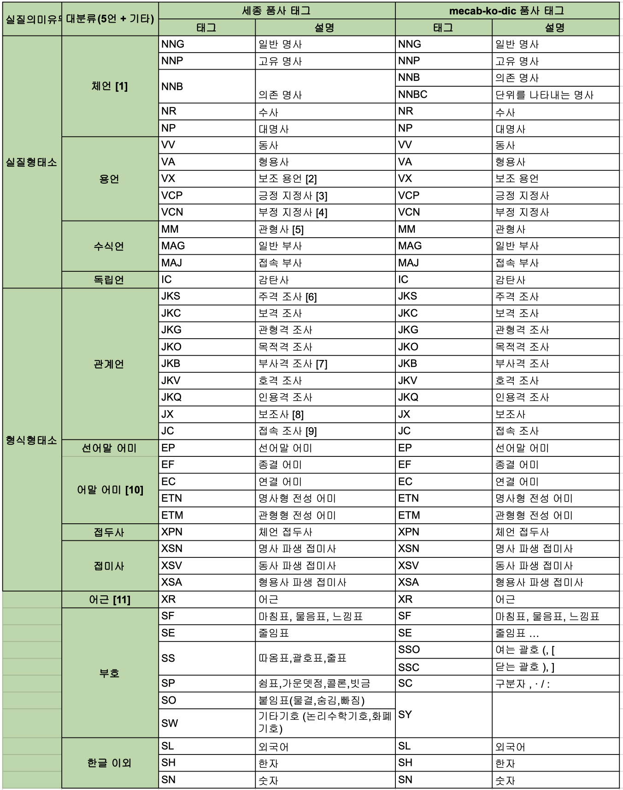
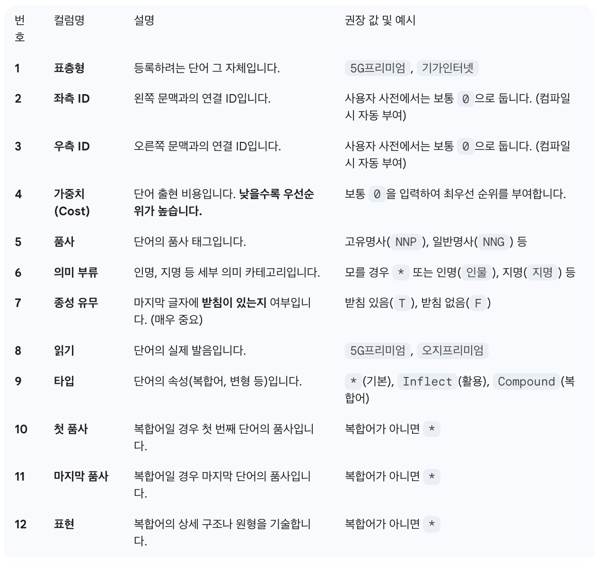

> * 맥북 M2 기준, homebrew 설치가 가장 깔끔합니다.
> * 파이썬에서 연동해서 사용하려면, `mecab-python3`를 설치해야합니다.
> * Linux는 실제 binary를 다운받아 설치하거나, `bash <(curl -s https://raw.githubusercontent.com/konlpy/konlpy/master/scripts/mecab.sh)` 실행

<br>

# 1. MeCab 설치
## 1.1. MeCab 엔진 및 사전 설치
```
brew unlink mecab
brew install mecab-ko mecab-ko-dic

# 한국어 사전 경로 확인 (표준 경로)
/opt/homebrew/lib/mecab/dic/mecab-ko-dic
```

## 1.2. 필요 Python 패키지 설치
```
poetry add konlpy
poetry add mecab-python3

(OR)

pip install konlpy mecab-python3
```

<br>

# 2. User Dictionary 설정
## 2.1. 사전 생성/초기화
```
# 사용자 사전 폴더 생성
sudo mkdir -p /opt/homebrew/lib/mecab/dic/mecab-ko-dic/user-dic
cd /opt/homebrew/lib/mecab/dic/mecab-ko-dic/user-dic

# 사용자 사전 CSV 작성 
# * 단어,0,0,0,품사,의미부류,종성유무,읽기,타입,첫품사,마지막품사,표현)
#   - 혹은 빈 파일 csv 파일 생성해도 됨.
echo "5G프리미엄,0,0,0,NNP,*,T,5G프리미엄,*,*,*,*,*" | sudo tee user.csv
```

## 2.2. 사전 컴파일 (바이너리 생성)
```
# mecab-ko 전용 인덱스 도구 위치 확인 후 실행
sudo /opt/homebrew/Cellar/mecab-ko/0.996-ko-0.9.2/libexec/mecab/mecab-dict-index \
-d /opt/homebrew/lib/mecab/dic/mecab-ko-dic \
-u /opt/homebrew/lib/mecab/dic/mecab-ko-dic/user.dic \
-f utf-8 -t utf-8 \
user.csv
```

## 2.3. dicrc 설정
```
# rc 파일 수정
sudo vi /opt/homebrew/lib/mecab/dic/mecab-ko-dic/dicrc

# 파일 맨 아래에 다음 내용 추가
userdic = /opt/homebrew/lib/mecab/dic/mecab-ko-dic/user.dic

# 강제 저장 및 종료
:w!
:q
```

<br>

## 2.4. 사전 업데이트
mecab-ko-dic 품사 태그


MeCab 사용자 사전 CSV 컬럼 정의서


### (1) 업데이트
```
sudo vi /opt/homebrew/lib/mecab/dic/mecab-ko-dic/user-dic/user.csv

<!-- 아래의 내용 추가 (원하는 복합어, 품사 태깅도 가능)-->
5G프리미엄,0,0,0,NNP,*,T,5G프리미엄,*,*,*,*,*
기가인터넷,0,0,0,NNP,*,T,기가인터넷,*,*,*,*,*
```
    
#### 1) test.py
```python
from konlpy.tag import Mecab
DIC_PATH = "/opt/homebrew/lib/mecab/dic/mecab-ko-dic"
mecab = Mecab(dicpath=DIC_PATH)

text = "5G프리미엄 요금제는 정말 빠르네요. 기가인터넷 속도가 정말 빠르네요."

print(f"형태소 분석: {mecab.morphs(text)}")
print(f"품사 태깅: {mecab.pos(text)}")
```
#### 2) output
```
형태소 분석: ['5G프리미엄', '요금제', '는', '정말', '빠르', '네요', '.', '기가인터넷', '속도', '가', '정말', '빠르', '네요', '.']
품사 태깅: [('5G프리미엄', 'NNP'), ('요금제', 'NNP'), ('는', 'JX'), ('정말', 'MAG'), ('빠르', 'VA'), ('네요', 'EF'), ('.', 'SF'), ('기가인터넷', 'NNP'), ('속도', 'NNG'), ('가', 'JKS'), ('정말', 'MAG'), ('빠르', 'VA'), ('네요', 'EF'), ('.', 'SF')]
```

### (2) 사용자 사전 재컴파일 (바이너리 업데이트)
```
# 1. 사전 루트 경로 이동
cd /opt/homebrew/lib/mecab/dic/mecab-ko-dic

# 2. 컴파일 명령 재실행
sudo /opt/homebrew/Cellar/mecab-ko/0.996-ko-0.9.2/libexec/mecab/mecab-dict-index \
-d /opt/homebrew/lib/mecab/dic/mecab-ko-dic \
-u /opt/homebrew/lib/mecab/dic/mecab-ko-dic/user.dic \
-f utf-8 -t utf-8 \
user-dic/user.csv
```

#### Tip) 컴파일 전후 용량 비교
```
ls -lh /opt/homebrew/lib/mecab/dic/mecab-ko-dic/user.dic
```

<br>
